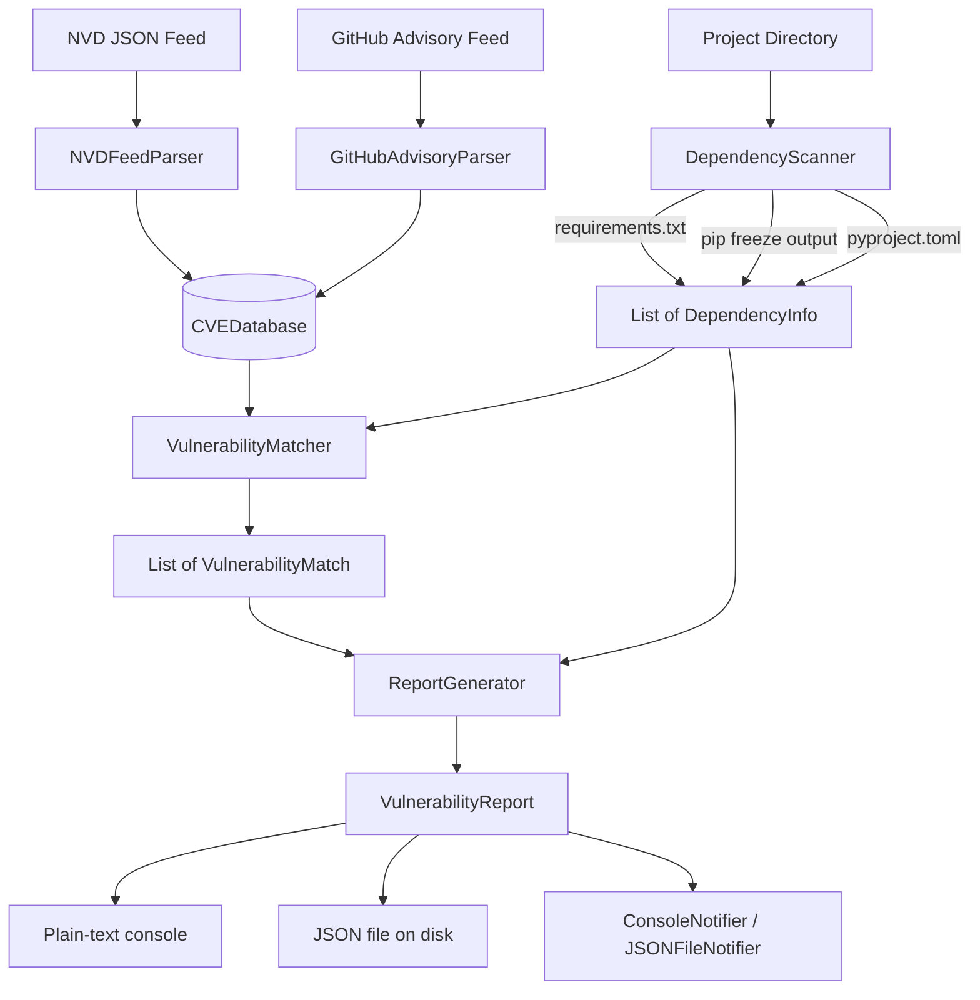

# aumai-agentcve

**Automated vulnerability tracking for AI agent frameworks.**

Part of the [AumAI](https://github.com/aumai) open-source infrastructure suite for agentic AI systems.

[](https://github.com/aumai/aumai-agentcve/actions)
[](https://pypi.org/project/aumai-agentcve/)
[](LICENSE)
[](https://www.python.org/)

---

## What is this?

Imagine you are a chef running a restaurant. Your kitchen relies on dozens of suppliers —
flour from one vendor, oil from another, spices from ten more. If any supplier's product
is recalled due to contamination, you need to know immediately which dishes are affected,
how serious the risk is, and what to do next.

`aumai-agentcve` does the same thing for Python software. Your AI agent or application
depends on dozens of third-party Python packages. Security researchers continuously
discover vulnerabilities in those packages and publish them to public databases — the
National Vulnerability Database (NVD) and GitHub Security Advisories (GHSA).
`aumai-agentcve` ingests those databases, reads your project's dependency list, matches
them together, and produces a clear vulnerability report ranked by severity.

It is designed specifically for the AI agent ecosystem, where production systems
frequently pin dependencies on frameworks such as LangChain, Transformers, or Pydantic
that have historically been targets for supply-chain attacks.

---

## Why does this matter?

### The problem from first principles

Every software project is an iceberg. The code you write sits above the waterline. Below
it lies a massive surface of third-party code you depend on but do not control. A
critical vulnerability in one transitive dependency — a package your package depends on —
can expose your entire production system even though you never wrote a single line of the
affected code.

The vulnerability disclosure ecosystem produces hundreds of new CVE records every week.
Without automation:

- Security teams manually scan dozens of repositories on no fixed schedule
- Developers do not learn about vulnerabilities until a breach or a periodic audit
- High-severity issues sit unpatched for weeks because no one has a clear picture of
  exposure
- AI agents running with broad filesystem or network permissions are especially dangerous
  to leave unpatched

`aumai-agentcve` closes that gap by making vulnerability scanning a first-class,
automatable step in any CI/CD pipeline.

### Why AI agents specifically?

AI agent frameworks carry unique risk because:

1. They execute arbitrary tool calls, often with broad filesystem or network access
2. They are updated frequently as the ecosystem matures, creating constant churn in the
   dependency tree
3. A compromised agent dependency can silently manipulate reasoning or exfiltrate prompts
   and responses
4. Supply-chain attacks targeting popular ML packages have increased significantly since
   2023

---

## Architecture



---

## Features

| Feature | Description |
|---|---|
| Multi-format dependency scanning | Parses `requirements.txt`, `pip freeze` output, and `pyproject.toml` (PEP 517 and Poetry) |
| NVD and GHSA feed ingestion | Load CVE data from NVD JSON exports and GitHub Security Advisory bulk exports |
| Confidence-scored matching | Each vulnerability match carries a confidence score (0.0–1.0); tune the threshold to control noise |
| CVSS-aligned severity | `critical`, `high`, `medium`, `low`, `unknown` severity levels with optional CVSS numeric score |
| Structured Pydantic reports | `VulnerabilityReport` is a typed model — serialize to JSON or render as human-readable text |
| CI/CD exit codes | `scan` exits with code 1 when vulnerabilities are found, acting as a natural pipeline gate |
| Bulk feed pre-processing | `ingest` command normalizes feeds without scanning — useful for caching and feed management |
| Report replay | `report` command re-renders any previously saved JSON report in text or JSON format |
| Name normalization | Package names are normalized (lowercase, hyphens) before matching, handling PyPI naming inconsistencies |
| Auto-discovery | Scanner finds dependency files automatically in priority order within a project directory |

---

## Quick Start

**Requirements:** Python 3.11+

```bash
# Install
pip install aumai-agentcve

# Download a CVE feed
# (Obtain NVD feeds from https://nvd.nist.gov/vuln/data-feeds)
# (Obtain GHSA feeds from https://github.com/advisories — bulk export)

# Scan the current directory against an NVD feed
agentcve scan --feed nvd-recent.json

# Scan a specific project and save a JSON report
agentcve scan \
  --feed nvd-recent.json \
  --project-dir /srv/my-agent \
  --output report.json

# Re-display a saved report
agentcve report \
  --scan-id a1b2c3d4-5678-90ab-cdef-1234567890ab \
  --report-file report.json
```

**Example output — clean scan:**

```
Loaded 342 CVEs from nvd-recent.json
Scanned 43 dependencies in my-agent
=== Vulnerability Report: my-agent ===
Scan ID   : a1b2c3d4-5678-90ab-cdef-1234567890ab
Timestamp : 2025-01-15T10:30:00+00:00
Total deps: 43
Vulnerable: 0
Summary   : No vulnerabilities detected.
```

**Example output — vulnerabilities found (exits with code 1):**

```
  [CRITICAL ] CVE-2024-56789  requests==2.28.0  confidence=90%
    CVSS: 9.1
    Server-Side Request Forgery in requests allows attackers to send arbitrary...

  [HIGH     ] CVE-2024-11111  pillow==9.0.0  confidence=80%
    CVSS: 7.5
    Buffer overflow in PNG decoder...
```

---

## CLI Reference

### `agentcve scan`

Scan a project directory for dependencies and match against loaded CVE feeds.

```
Usage: agentcve scan [OPTIONS]

Options:
  --project-dir PATH        Project directory to scan for dependencies.
                            [default: .]
  --feed PATH               NVD/GHSA JSON feed file(s) to load CVEs from.
                            Repeatable — pass multiple --feed flags.
  --output PATH             Write JSON report to this file.
  --min-confidence FLOAT    Minimum match confidence (0.0-1.0) to include in
                            report. [default: 0.5]
  --format [text|json]      Output format for console report. [default: text]
  --version                 Show version and exit.
  --help                    Show this message and exit.
```

Exit codes:
- `0` — scan completed, no vulnerabilities found
- `1` — scan completed, one or more vulnerabilities found (or fatal error)

**Examples:**

```bash
# Basic scan
agentcve scan --feed nvd-2024.json

# Multiple feeds, specific directory, save report
agentcve scan \
  --feed feeds/nvd-2024.json \
  --feed feeds/ghsa-python.json \
  --project-dir /srv/myagent \
  --output /tmp/vuln-report.json

# Output raw JSON to stdout (useful for piping to jq)
agentcve scan --feed nvd.json --format json | jq '.matches[].cve.cve_id'

# CI gate — fail build on any vulnerability
agentcve scan --feed nvd.json && echo "Clean" || { echo "VULNERABILITIES FOUND"; exit 1; }

# Raise threshold to reduce noise — only surface high-confidence matches
agentcve scan --feed nvd.json --min-confidence 0.8
```

---

### `agentcve ingest`

Parse and normalize a CVE feed file, optionally exporting the result.

```
Usage: agentcve ingest [OPTIONS]

Options:
  --feed PATH               NVD or GHSA JSON feed file to ingest. [required]
  --format [nvd|ghsa|auto]  Feed format. 'auto' detects from file structure
                            (list = GHSA, dict = NVD). [default: auto]
  --output PATH             Write parsed CVEs as JSON array to this file.
  --help                    Show this message and exit.
```

**Examples:**

```bash
# Pre-process an NVD feed and cache normalized output
agentcve ingest --feed nvd-2024.json --format nvd --output cves-normalized.json

# Auto-detect format
agentcve ingest --feed advisories.json --output parsed.json

# Count CVEs in a feed without saving
agentcve ingest --feed nvd-2024.json
# Output: Parsed 1247 CVE records from nvd-2024.json
```

---

### `agentcve report`

Re-display a previously generated vulnerability report from a JSON file.

```
Usage: agentcve report [OPTIONS]

Options:
  --scan-id TEXT            Scan ID to look up (must match report file).
                            [required]
  --report-file PATH        Path to the JSON report file produced by 'scan'.
                            [required]
  --format [json|text]      Output format. [default: text]
  --help                    Show this message and exit.
```

**Examples:**

```bash
# Render a saved report as text
agentcve report \
  --scan-id a1b2c3d4-5678-90ab-cdef-1234567890ab \
  --report-file reports/scan-2025-01-15.json

# Export a saved report to JSON (e.g., for ingestion into another tool)
agentcve report \
  --scan-id a1b2c3d4-5678-90ab-cdef-1234567890ab \
  --report-file reports/scan-2025-01-15.json \
  --format json
```

---

## Python API

### Scanning dependencies

```python
from pathlib import Path
from aumai_agentcve.core import DependencyScanner

scanner = DependencyScanner()

# Auto-discover and scan all dependency files in a directory
# Priority: requirements-freeze.txt > requirements.txt > pyproject.toml
deps = scanner.scan_directory(Path("/srv/myagent"))
for dep in deps:
    print(f"{dep.name} == {dep.version}  (source: {dep.source})")

# Parse a requirements.txt string directly
content = open("requirements.txt").read()
deps = scanner.scan_requirements_txt(content)

# Parse pip freeze output
import subprocess
freeze_output = subprocess.check_output(["pip", "freeze"]).decode()
deps = scanner.scan_pip_freeze(freeze_output)

# Parse pyproject.toml (PEP 517 and Poetry)
content = open("pyproject.toml").read()
deps = scanner.scan_pyproject_toml(content)
```

### Loading and querying CVE data

```python
import json
from aumai_agentcve.core import CVEDatabase
from aumai_agentcve.models import CVESeverity

database = CVEDatabase()

# Load from an NVD JSON feed file
with open("nvd-feed.json") as f:
    data = json.load(f)
added = database.load_json(data)
print(f"Loaded {added} new CVEs. Total: {database.count}")

# Look up a specific CVE
record = database.get("CVE-2024-12345")
if record:
    print(f"{record.cve_id}: {record.severity.value} — CVSS {record.cvss_score}")

# Search all CVEs mentioning a package
records = database.search_by_package("requests")
for r in records:
    print(f"  {r.cve_id}: {r.description[:80]}")

# Filter by severity level
critical_cves = database.filter_by_severity(CVESeverity.critical)
print(f"Critical CVEs in database: {len(critical_cves)}")
```

### Matching vulnerabilities

```python
from aumai_agentcve.core import VulnerabilityMatcher

matcher = VulnerabilityMatcher(database)

# Match with default 50% confidence threshold
matches = matcher.match(deps)

# Raise threshold to reduce false positives
matches = matcher.match(deps, min_confidence=0.75)

for match in matches:
    print(
        f"{match.cve.cve_id} matched {match.dependency.name}=={match.dependency.version} "
        f"with {match.match_confidence:.0%} confidence"
    )
```

### Generating reports

```python
from aumai_agentcve.core import ReportGenerator

generator = ReportGenerator()

report = generator.generate(
    project_name="my-agent",
    dependencies=deps,
    matches=matches,
)

print(f"Scan ID: {report.scan_id}")
print(f"Total deps: {report.total_dependencies}")
print(f"Vulnerable: {report.vulnerable_dependencies}")
print(report.summary)

# Render as human-readable text
print(generator.to_text(report))

# Serialize to JSON string
json_string = generator.to_json(report)

# Save to file
with open("report.json", "w") as f:
    f.write(generator.to_json(report))

# Reload from JSON
from aumai_agentcve.models import VulnerabilityReport
reloaded = VulnerabilityReport.model_validate_json(json_string)
```

### Working with models directly

```python
from datetime import datetime, UTC
from aumai_agentcve.models import CVERecord, CVESeverity, DependencyInfo, VulnerabilityMatch

# Create a CVE record manually (useful for testing or custom feeds)
cve = CVERecord(
    cve_id="CVE-2024-99999",       # Validated: must start with CVE- or GHSA-
    description="Arbitrary code execution via crafted YAML input",
    severity=CVESeverity.critical,
    cvss_score=9.8,
    published_date=datetime.now(UTC),
    affected_packages=["pyyaml"],
    references=["https://nvd.nist.gov/vuln/detail/CVE-2024-99999"],
)

# DependencyInfo auto-normalizes names
dep = DependencyInfo(name="PyYAML", version="5.4.1")
print(dep.name)  # "pyyaml" — lowercased with hyphen normalization
```

---

## Configuration Options

`aumai-agentcve` is configured through CLI flags and the Python API. There is no
configuration file by default.

| Parameter | CLI flag | API parameter | Default | Description |
|---|---|---|---|---|
| Project directory | `--project-dir` | `scan_directory(path)` | `.` | Where to look for dependency files |
| CVE feed files | `--feed` | `database.load_json()` | (none) | NVD or GHSA JSON feeds |
| Min confidence | `--min-confidence` | `matcher.match(min_confidence=)` | `0.5` | Minimum match confidence to include |
| Output format | `--format` | `generator.to_text()` / `to_json()` | `text` | Console output format |
| Report file | `--output` | `to_json()` + file write | (none) | Path to save JSON report |
| Feed format | `ingest --format` | N/A | `auto` | `nvd`, `ghsa`, or `auto` |

**Dependency file discovery priority:**

1. `requirements-freeze.txt` — highest fidelity; exact pinned versions from `pip freeze`
2. `requirements.txt` — may contain range constraints
3. `pyproject.toml` — PEP 517 `[project]` or Poetry `[tool.poetry.dependencies]`

Duplicate packages (same name and version) are deduplicated automatically across sources.

---

## How it works — Technical Deep-Dive

### Dependency parsing details

`DependencyScanner` implements three parsers. All parsers normalize package names to
lowercase with hyphens, matching PyPI canonical form. This normalization is critical for
reliable matching because CVE databases use inconsistent casing.

`scan_requirements_txt` handles the full practical PEP 440 grammar including:
- Exact pins: `package==1.2.3` — version extracted as `1.2.3`
- Range constraints: `package>=1.0,<2.0` — full specifier stored as version string
- PEP 440 direct references: `package @ https://...` — version stored as `unknown`
- Inline comments stripped before parsing
- `-r include.txt` references skipped

`scan_pyproject_toml` is a line-based state machine rather than a full TOML parser,
avoiding a runtime dependency on `tomllib` while correctly handling both PEP 517
`[project] dependencies` inline arrays and Poetry `[tool.poetry.dependencies]` key-value
tables.

### CVE database internals

`CVEDatabase` is an in-memory dict keyed by `cve_id`. `search_by_package` applies the
same name normalization (lowercase, underscore-to-hyphen) to both the query and the
`affected_packages` field of each CVE record, then uses substring containment matching.
This means searching for `Pillow` will match a CVE record with affected package
`pillow-core`.

### Matching algorithm

`VulnerabilityMatcher` delegates to `find_matches()` in the `matcher` module. The
confidence score reflects how closely the dependency name matches the CVE's affected
packages list. Exact normalized matches score highest; substring matches score lower.
The `min_confidence` threshold (default 0.5) filters the result before it reaches the
report.

### Report serialization

`VulnerabilityReport` uses Pydantic v2's `model_dump(mode="json")`, which serializes
`datetime` objects as ISO 8601 strings and `Enum` values as their string representations.
The `scan_id` is a UUIDv4 generated at report creation time, providing a stable
identifier for report replay.

---

## Integration with other AumAI projects

- **aumai-specs**: Run `agentcve scan` as a pre-commit or CI step in any project that
  uses `aumai-specs` for contract validation. Fail builds if new vulnerabilities are
  introduced by dependency upgrades.
- **aumai-opensafety**: CVE disclosures affecting AI agent frameworks are a category of
  AI safety incident. Export `VulnerabilityReport` JSON and import into `opensafety`
  for longitudinal safety tracking and trend analysis.
- **aumai-protocolbridge**: Agent communication adapters (MCP, A2A, OpenAI, Anthropic)
  are dependencies. Scan them with `agentcve` whenever a new protocol adapter version is
  pinned to catch supply-chain vulnerabilities before deployment.

---

## Contributing

Contributions are welcome. Please read `CONTRIBUTING.md` before opening a pull request.

1. Fork the repository
2. Create a feature branch: `git checkout -b feature/my-improvement`
3. Run the test suite: `make test`
4. Run linting: `make lint` (ruff + mypy strict)
5. All new code requires type hints; no `Any` without justification
6. Conventional commit messages: `feat:`, `fix:`, `refactor:`, `docs:`, `test:`, `chore:`
7. Squash-merge PRs to keep history clean

---

## License

Apache License 2.0. See `LICENSE` for the full text.

```
Copyright 2025 AumAI Contributors

Licensed under the Apache License, Version 2.0 (the "License");
you may not use this file except in compliance with the License.
You may obtain a copy of the License at

    http://www.apache.org/licenses/LICENSE-2.0
```
